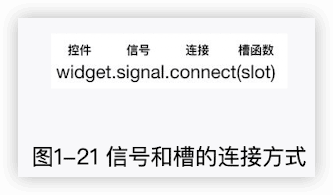
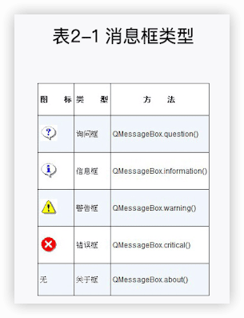
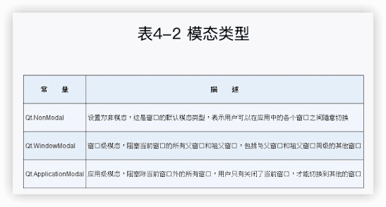
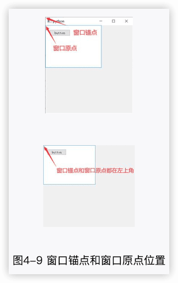
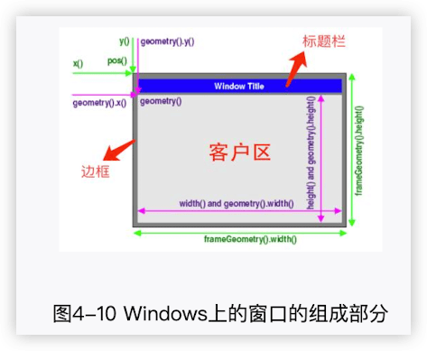
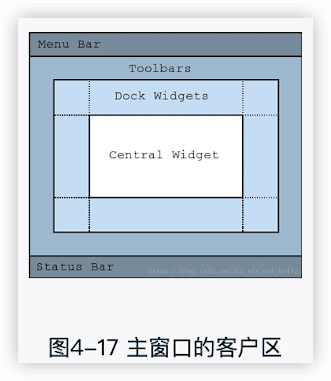
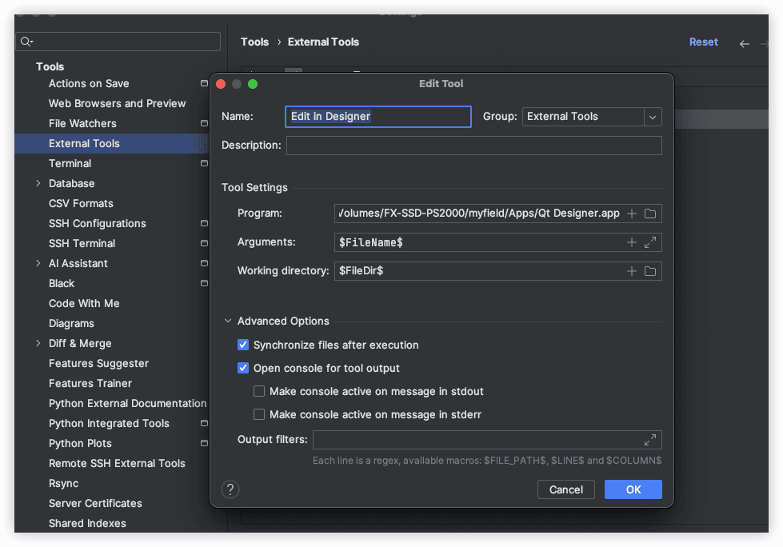
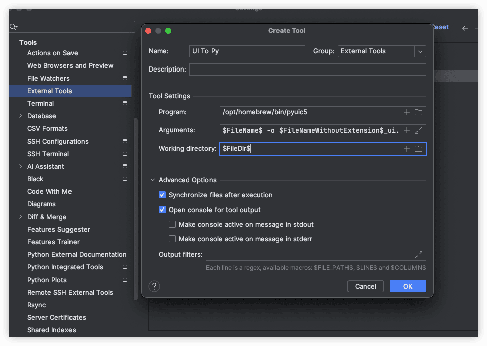
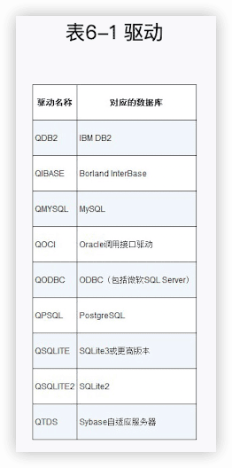

[PyQt编程快速上手](https://book.douban.com/subject/36337901/)
---

PyQt是一个创建GUI应用程序的工具包，是Python编程语言和Qt库的成功融合。


## 1 PyQt基础

### 1.1 安装


```
pip3 install pyqt5==5.15.4

pip3 install pyqt5==5.15.4 -i https://pypi.tuna.tsinghua.edu.cn/simple
```


安装预编译的 PyQt5 轮子：

```
pip3 install pyqt5 -i https://pypi.tuna.tsinghua.edu.cn/simple --only-binary :all:
```


### 1.2 设计一个简单的PyQt窗口


### 1.3 布局管理

#### 1.3.1 使用move()方法布局


#### 1.3.2 垂直布局管理器QVBoxLayout


#### 1.3.3 水平布局管理器QHBoxLayout


#### 1.3.4 表单布局管理器QFormLayout


#### 1.3.5 网格布局管理器QGridLayout


### 1.4 信号和槽

信号和槽机制是PyQt中各个对象之间的通信基础。

#### 1.4.1 理解信号和槽机制

红灯信号发射后，行人就会停下；当绿灯信号发射后，行人就会前进。我们用red和green来表示信号，用stop()和go()函数来表示行人的动作，这两个函数也被称为槽函数。也就是说，当red信号发射后，stop()槽函数就会被调用；当green信号发射后，go()槽函数会被调用。不过信号和槽只有在连接之后才可以起作用，连接方式如图1-21所示。

在图1-21中，widget就是PyQt中的控件对象，signal就是控件对象拥有的信号，connect()方法用于连接信号和槽，而slot是槽函数名称。我们参考上面的红绿灯例子，了解代码中的连接方式：

```python
traffic_light.red.connect(stop)
traffic_light.green.connect(go)
```



red信号和stop()槽函数进行连接，green信号和go()槽函数进行连接，只有这样连接后，发射的信号才可以调用相应的槽函数。总结起来就一句话：连接后，信号发射，槽函数“启动”。

> 在connect()方法中传入的是函数名。

#### 1.4.2 一个信号连接一个槽


#### 1.4.3 一个信号连接多个槽


#### 1.4.4 多个信号连接一个槽


#### 1.4.5 信号与信号连接


#### 1.4.6 自定义信号


### 1.5 学会使用文档


## 2 PyQt的基础控件

### 2.1 标签控件QLabel

#### 2.1.1 显示文本


#### 2.1.2 显示图片


#### 2.1.3 显示动图


### 2.2 消息框控件QMessageBox

#### 2.2.1 各种类型的消息框




#### 2.2.2 与消息框交互


#### 2.2.3 编写带中文按钮的消息框


### 2.3 文本框控件

#### 2.3.1 单行文本框控件QLineEdit


#### 2.3.2 文本编辑框控件QTextEdit


#### 2.3.3 文本浏览框控件QTextBrowser


### 2.4 各种按钮控件

#### 2.4.1 普通按钮控件QPushButton


#### 2.4.2 工具按钮控件QToolButton


#### 2.4.3 单选框按钮控件QRadioButton


#### 2.4.4 复选框按钮控件QCheckBox


#### 2.4.5 下拉框按钮控件QComboBox


### 2.5 与数字相关的控件

#### 2.5.1 液晶数字控件QLCDNumber


#### 2.5.2 数字调节框控件QSpinBox和QDoubleSpinBox


#### 2.5.3 滑动条控件QSlider


#### 2.5.4 仪表盘控件QDial


### 2.6 与日期相关的控件

#### 2.6.1 日历控件QCalendarWidget


#### 2.6.2 日期时间控件QDateTimeEdit


### 2.7 定时器控件和进度条控件

#### 2.7.1 定时器控件QTimer


#### 2.7.2 进度条控件QProgressBar


## 3 PyQt的高级控件

之所以称它们为高级控件，是因为它们在用法上更有难度，通常需要联系到其他模块，开发者要注意的点也会更多。

### 3.1 组合框控件和工具箱控件

#### 3.1.1 分组框控件QGroupBox


#### 3.1.2 工具箱控件QToolBox


### 3.2 滚动区域控件和滚动条控件

#### 3.2.1 滚动区域控件QScrollArea


#### 3.2.2 滚动条控件QScrollBar


### 3.3 更多容器控件

#### 3.3.1 拆分窗口控件QSplitter


#### 3.3.2 标签页控件QTabWidget


#### 3.3.3 堆栈控件QStackedWidget


#### 3.3.4 多文档区域控件QMdiArea


### 3.4 列表视图控件、树形视图控件、表格视图控件

#### 3.4.1 列表视图控件QListView


#### 3.4.2 树形视图控件QTreeView


#### 3.4.3 表格视图控件QTableView


### 3.5 简化版的列表、树形、表格视图控件

#### 3.5.1 简化版列表视图控件QListWidget


#### 3.5.2 简化版树形视图控件QTreeWidget


#### 3.5.3 简化版表格视图控件QTableWidget


### 3.6 各种对话框控件

#### 3.6.1 颜色对话框控件QColorDialog


#### 3.6.2 字体对话框控件QFontDialog


#### 3.6.3 输入对话框控件QInputDialog


#### 3.6.4 文件对话框控件QFileDialog


## 4 深入窗口

在之前的章节中，所有的窗口都是基于QWidget类的。其实在PyQt中，任何一个控件都可以看作一个窗口，比如示例代码4-1中的QLineEdit控件就单独显示为一个窗口。


### 4.1 窗口属性

#### 4.1.1 窗口标题和图标


#### 4.1.2 窗口大小和位置


表4-1 跟窗口大小和位置有关的方法


#### 4.1.3 其他窗口属性




### 4.2 窗口坐标

#### 4.2.1 理解坐标体系



#### 4.2.2 窗口的组成部分




表4-3 获取坐标和大小的方法


### 4.3 窗口事件

#### 4.3.1 窗口关闭事件


#### 4.3.2 窗口大小调整事件


#### 4.3.3 键盘事件


#### 4.3.4 鼠标事件


#### 4.3.5 拖放事件


#### 4.3.6 绘制事件


### 4.4 主窗口类QMainWindow

QMainWindow继承于QWidget。如果说把QWidget比作一间毛坯房，那QMainWindow就在这间毛坯房的基础上划出了几个房间，各个房间里都有一些装修工具，让我们这些装修工人能够更快、更好地布置房间。在较为复杂和功能较多的应用程序中，我们通常继承QMainWindow类来开发窗口。

#### 4.4.1 主窗口的组成部分

主窗口也是由标题栏、客户区和边框组成的，不过它的客户区还可以被进一步细分，请看图4-17。



可以在主窗口上添加菜单栏、工具栏、状态栏。除此之外，它还提供了一块停靠区域，在这块区域，控件的自由度非常高，用户能够随意变换控件的位置。中央控件(Central Widget)用来显示窗口的主要内容。


#### 4.4.2 停靠窗口类QDockWidget


#### 4.4.3 菜单栏类QMenuBar


#### 4.4.4 工具栏类QToolBar


#### 4.4.5 状态栏类QStatusBar


#### 4.4.6 程序启动画面类QSplashScreen


## 5 Qt Designer

在PyQt中，我们既可以使用代码来设计界面，也可以用Qt Designer来快速完成设计。Qt Designer能够让我们以可视化拖曳的方式来摆放控件，而且可以立即看到设计效果，没有编程经验的人也可以快速上手。界面设计完毕后，我们可以将它保存到格式为.ui的文件中，并利用pyuic5工具将其转换成.py文件，这样就能够在代码中继续给界面添加其他功能了。

### 5.1 安装与配置

https://build-system.fman.io/qt-designer-download


#### 在PyCharm中配置设计师



pyuic5 是 PyQt5 工具包中一个非常实用的命令行工具，主要用于将 Qt Designer 创建的 `.ui` 文件（XML格式）转换为可直接在 Python 中使用的 `.py` 文件。

配置pyuic5转换工具

```sh
which pyuic5
/opt/homebrew/bin/pyuic5
```



“Arguments”填写“`$FileName$ -o $FileNameWithoutExtension$_ui.py`”，表示将×××.ui文件转换成×××_ui.py文件。在“Working directory”输入框中填写“`$FileDir$`”。


### 5.2 了解设计师窗口中的各个部分

#### 5.2.1 控件箱


#### 5.2.2 对象查看器


#### 5.2.3 属性编辑器


#### 5.2.4 菜单栏和工具栏


### 5.3 4种编辑模式

#### 5.3.1 布局模式


#### 5.3.2 编辑信号和槽模式


#### 5.3.3 编辑伙伴关系模式


#### 5.3.4 编辑Tab顺序模式


### 5.4 登录框开发实战

🔖


## 6 PyQt高级应用

PyQt的强大不仅体现在多种多样的控件上，它还在数据库、多线程、动画和音视频等方面提供了丰富的支持。除此之外，PyQt还有自己的一套界面美化系统QSS，它能够让界面变得更美观。我们可以把PyQt看作集合了众多第三方库的功能的大型工具箱，各种工具应有尽有。

### 6.1 数据库



#### 6.1.1 数据库连接和关闭


#### 6.1.2 执行SQL语句


#### 6.1.3 数据库模型

##### 1.QSqlQueryModel


##### 2.QSqlTableModel


### 6.2 多线程

在PyQt中，主线程（也可以称为UI线程）负责界面绘制和更新。当执行某些复杂且耗时的操作时，如果将执行这些操作的代码放在主线程中，界面就会出现停止响应（或卡顿）的情况。

#### 6.2.1 使用QThread线程类


#### 6.2.2 在线程中获取窗口数据信息


### 6.3 绘图与打印

#### 6.3.1 画笔类QPen


#### 6.3.2 画刷类QBrush


#### 6.3.3 用鼠标在窗口上绘制矩形


#### 6.3.4 打印


### 6.4 动画

#### 6.4.1 属性动画类QPropertyAnimation


#### 6.4.2 串行动画组类QSequentialAnimationGroup


#### 6.4.3 并行动画组类QParallelAnimationGroup


#### 6.4.4 时间轴类QTimeLine


### 6.5 音频和视频

#### 6.5.1 声音类QSound


#### 6.5.2 音效类QSoundEffect


#### 6.5.3 媒体播放机类QMediaPlayer


### 6.6 网页交互


#### 6.6.1 了解QWebEngineView


#### 6.6.2 制作一款简单的浏览器


### 6.7 网络应用

#### 6.7.1 QUdpSocket


#### 6.7.2 QTcpSocket和QTcpServer


### 6.8 QSS

QSS是一种用来自定义控件外观的强大机制。它的语法跟CSS非常相似。

窗口或控件可以通过调用setStyleSheet()方法来设置外观样式，该方法接收一个QSS样式字符串，样式内容可以保存在.qss或者.css格式的文件中。

#### 6.8.1 安装QSS高亮插件

#### 6.8.2 基本规则

每个QSS样式都由选择器和声明这两部分组成，前者用来指定样式所作用的控件对象，后者用来指定样式使用的属性和值。


#### 6.8.3 选择器的类型


#### 6.8.4 子控制器


#### 6.8.5 伪状态


#### 6.8.6 QSS第三方库

##### 1.Qt-Material

```
pip3 install qt-material
```


##### 2.QDarkStyleSheet

```
pip3 install qdarkstyle
```


### 6.9 国际化 🔖

#### 6.9.1 使用translate()方法


#### 6.9.2 制作.ts文件


#### 6.9.3 使用Qt Linguist


#### 6.9.4 实现语言切换功能


## 7 图形视图框架

### 7.1 图形图元类QGraphicsItem

#### 7.1.1 标准图元

- 椭圆图元QGraphicsEllipseItem。
- 直线图元QGraphicsLineItem。
- 路径图元QGraphicsPathItem。
- 图片图元QGraphicsPixmapItem。
- 多边形图元QGraphicsPolygonItem。
- 矩形图元QGraphicsRectItem。
- 纯文本图元QGraphicsSimpleTextItem。
- 富文本图元QGraphicsTextItem。


#### 7.1.2 图元层级


#### 7.1.3 图元变换


#### 7.1.4 图元分组


#### 7.1.5 碰撞检测


#### 7.1.6 给图元添加信号和动画


### 7.2 图形场景类QGraphicsScene

#### 7.2.1 管理图元


#### 7.2.2 嵌入控件


### 7.3 图形视图类QGraphicsView

#### 7.3.1 视图和场景的大小关系


#### 7.3.2 视图变换


### 7.4 事件传递与坐标转换

#### 7.4.1 事件传递顺序


#### 7.4.2 坐标转换


## 8 打包

程序编写完成并成功运行之后，我们就可以将其打包成可执行文件发送给朋友或者客户。他们可以直接通过双击来运行这个可执行文件，不需要安装Python环境，这是打包带来的好处之一。另外，我们还可以通过打包来加密程序，以提高程序安全性。

PyInstaller和Nuitka是目前十分流行的两个打包库。

### 8.1 PyInstaller

PyInstaller的用法非常简单，而且它的打包速度很快。通过它我们能够将程序打包成Windows、macOS和Linux上的可执行文件。PyInstaller已经成功运用在一些不常见的系统上，比如AIX、Solaris、FreeBSD和OpenBSD。PyInstaller官方也在不断更新，所以能够被PyInstaller打包的第三方库也越来越多，“坑”也越来越少。


### 8.2 Nuitka

Nuitka会把要打包的代码编译成C语言版本，这样不仅可提升程序的运行效率，也可加强代码安全性。这个打包库使用起来也很简单，而且有很多打包逻辑跟PyInstaller的打包逻辑是类似的，比如Nuitka也有单文件打包模式和多文件打包模式，也需要通过黑框来查看报错信息，等等。


## 9 可视化爬虫

```
pip3 install requests
pip3 install parsel
```


https://quotes.toscrape.com/


## 10 贪吃蛇

