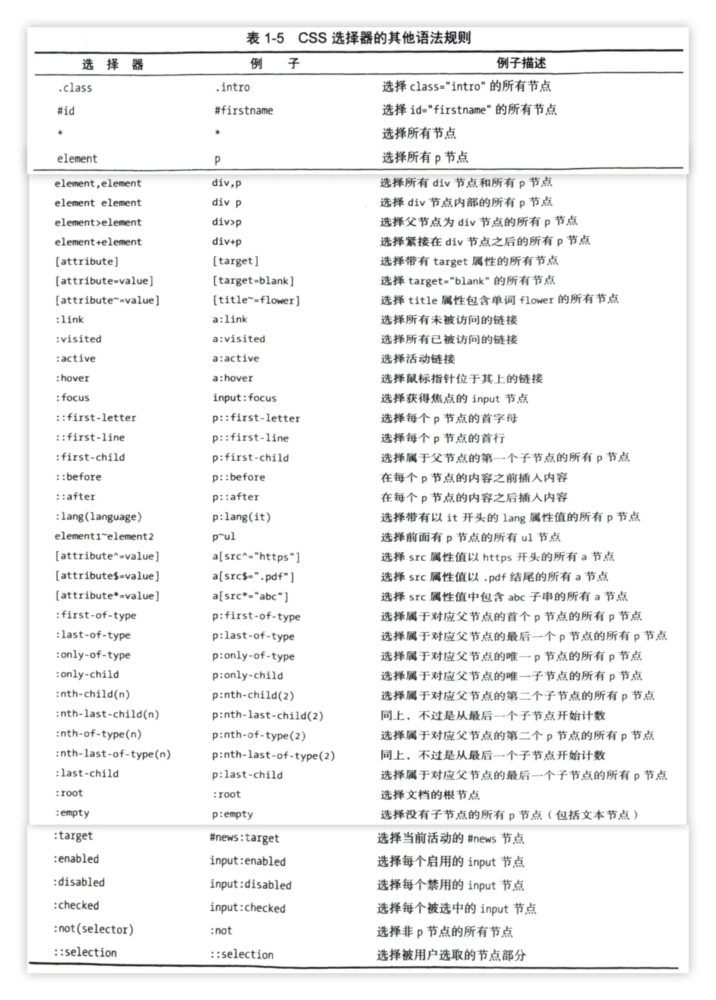

《Python3网络爬虫开发实战》第2版 笔记
--------------

网络爬虫与反爬措施

https://github.com/Python3WebSpider

[爬虫案例平台](https://scrape.center/)

## 前言

现在的网页采取了各种**防护措施**，比如**前端代码的压缩和混淆、API的参数加密、WebDriver的检测**，因此要做到高效的数据爬取，需要我们懂一些**JavaScript逆向分析技术**。

与此同时 ，**App的抓包防护、加壳保护、本地化、风控检测**使得越来越多的App数据难以爬取，所以我们不得不了解一些**App逆向**相关的技术，比如**Xposed、Frida、IDA Pro** 等工具的使用。

近几年，深度学习和人工智能发展得也是如火如茶，所以爬虫还可以和人工智能相结合，比如**基于深度学习的验 证码识别、网页内容的智能解析和提取等技术**。另外， 一些大规模爬虫的管理和运维技术也在不断发
展 ，当前Kubernetes、Docker、Prometheus等云原生技术也非常火爆，基于Kubernetes等云原生技术的爬虫管理和运维解决方案也已经很受青睐。


## 1 开发环境配置

### 1.1 Python3安装

### 1.2 请求库安装

#### requests
`sudo pip3 install requests`

#### selenium
`sudo pip3 install selenium`      selenium 是自动化测试工具，需要浏览器配合使用


##### Mac 中python3的两个库地址问题
/usr/local/lib/python3.7/site-packages
/Library/Python/3.7/site-packages


`python3 -m pip install -U selenium` 安装在前者
`sudo pip3 install selenium` 安装在后者

#### PhantomJS

PhantomJS是一个无界面的、可脚本编程的WebKit浏览器引擎，它原生支持多种Web标准：DOM操作、CSS选择、JSON、Canvas以及SVG。
？？

#### aiohttp 

aiohttp是相对于 requests库的一个异步Web服务端的库

`python3 -m pip install -U aiohttp`

`python3 -m pip install -U cchardet aiodns`
cchardet是字符编码检测库，aiodns是加速DNS的解析库


## 1 爬虫基础

### 1.1 HTTP基本原理

#### 1️⃣ URI和URL


URL:

```
scheme://[username:password@]hostname[:port][/path][;parameters][?query][#fragment]
```


#### 2️⃣ НТТР和HTTPS


#### 3️⃣ HTTP请求过程


#### 4️⃣ 请求

- 请求方法


- 请求网址


- 请求头

`Accept`

`Accept-Language`

`Accept-Encoding`

`Host`

`Cookie`

`Referer`

`User-Agent`(UA)

`Content-Type`，也叫互联网媒体类型（Internet Media Type）或者MIME类型，在HTTP协议消息头中，它用来表示具体请求中的媒体类型信息。

- 请求体


#### 5️⃣ 响应

- 响应状态码


- 响应头


- 响应体


#### 6️⃣ HTTP 2.0

相比HTTP1.1来说，HTTP2.0变得更快、更简单、更稳定。HTTP2.0在传输层做了很多优化，它的主要目标是通过支持完整的请求与响应复用来减少延迟，并通过有效压缩HTTP请求头字段的方式将协议开销降至最低，同时增加对请求优先级和服务器推送的支持，这些优化一笔勾销了HTTP1.1做传输优化想出的一系列“歪招”。

为什么不叫HTTP1.2而叫HTTP2.0呢?

因为HTTP2.0内部实现了新的==二进制分帧层==，没法与之前HTTP1x的服务器和客户端兼容，所以直接修改主版本号为2.0。

优化点：🔖

- 二进制分帧层
- 多路复用
- 流控制
- 服务端推

> HTTP 2.0 发展现状
>
> 一些主流的网站现在已经支持HTTP2.0 了，主流浏 览器现在都已经实现了对HTTP 2.0 的支持，但总体上，目前大部分网站依然以HTTP 1.1 为主。
>
> 对于Python来说，hyper、httpx等库已 经支持了HTTP2.0，但广泛使用的requests库依然只支持HTTP1.1。

### 1.2 Web网页基础

#### 1 网页的组成

HTML、CSS 和JavaScript


#### 2 网页的结构


#### 3 节点树及节点间的关系


#### 4 选择器




### 1.3 爬虫的基本原理


### 1.4 Session和Cookie


### 1.5 代理的基本原理


#### 代理分类

根据协议区分：

- FTP代理服务器:主要用于访问FTP服务器，一般有上传、下载以及缓存功能，端又一般力21、2121等。
- HTTP代理服务器:主要用于访问网页，一般有内容过滤和缓存功能，端又一般力80、8080、3128等。
- SSL/TLS代理:主要用于访问加密网站，一般有SSL或TLS加密功能(最高支持128位加密强度)，端又一般为443。
- **RTSP代理**:主要用于Realplayer访问Real流媒体服务器，一般有缓存功能，端又一般为554。
- **Telnet代理**:主要用于Telnet远程控制(黑客入侵计算机时常用于隐藏身份)，端又一般为23。
- **POP3/SMTP代理**:主要用于以POP3/SMTP方式收发邮件，一般有缓存功能，端又一般力110/25。
- **SOCKS代理**:只是单纯传递数据包，不关心具体协议和用法，所以速度快很多，一般有缓存功能，端又一般为1080。SOCKS代理协议又分为SOCKS4和SOCKSS,SOCKS4协议只支持TCP,SOCKS5协议则支持TCP和UDP，还支持各种身份验证机制、服务器端域名解析等。简单来说，SOCKS4能做到的SOCKS5都能做到，但SOCKSS能做到的SOCKS4不一定做得到。

根据匿名程度区分：

- **高度匿名代理**:高度匿名代理会将数据包原封不动地转发，在服务端看来似乎真的是一个普通客户端在访问，记录的IP则是代理服务器的IP。
- **普通匿名代理**:普通匿名代理会对数据包做一些改动，服务端可能会发现正在访问自己的是个代理服务器，并且有一定概率去追查客户端的真实IP。这里代理服务器通常会加人的HTTP头有`HTTP_VIA`和`HTTP_X_FORWARDED_FOR`。
- **透明代理**:透明代理不但改动了数据包，还会告诉服务器客户端的真实IP。这种代理除了能用缓存技术提高浏览速度，用内容过滤提高安全性之外，并无其他显著作用，最常见的例子是内网中的硬件防火墻。又
- **间谍代理**:间谍代理是由组织或个人创建的代理服务器，用于记录用户传输的数据，然后对记录的数据进行研究、监控等。

#### 常见代理设置

- 对于网上的免费代理，最好使用高度匿名代理，可以在使用前把所有代理都抓取下来筛选一下可用代理，也可以进一步维护一个代理池。
- 使用付费代理服务。互联网上存在许多可以付费使用的代理商，质量要比免费代理好很多。
- ADSL拨号，拨一次号换一次IP，稳定性高，也是一种比较有效的封锁解决方案。
- 蜂窝代理，即用4G或5G网卡等制作的代理。由于用蜂窝网络作为代理的情形较少，因此整体被封锁的概率会较低，但搭建蜂窝代理的成本是较高的。

### 1.6 多线程和多进程的基本原理


#### Python中的多线程和多进程 🔖

GIL全称次Global Interpreter Lock，意思是**全局解释器锁**，其设计之初是出于对**数据安全**的考虑。

在Python多线程下，每个线程的执行方式分如下三步。

- 获取GIL。
- 执行对应线程的代码。
- 释放GIL。


Python的多进程相比多线程，运行效率在多核情况下比单核会有成倍提升。

[Python爬虫进阶五之多线程的用法](https://cuiqingcai.com/3325.html)

[Python爬虫进阶六之多进程的用法](https://cuiqingcai.com/3335.html)


## 2 基本库的使用


### 2.1 urllib

urllib包括四个模块：

- request：这是最基本的HTTP 请求模块，可以模拟请求的发送。就像在浏览器里输人网址然后按下回车一样，只需要给库方法传入URL 以及额外的参数，就可以模拟实现发送请求的过程了。

- error：异常处理模块。如果出现请求异常，那么我们可以捕获这些异常，然后进行重试或其他操作以保证程序运行不会意外终止。

- parse：一个工具模块。提供了许多 URL 的处理方法，例如拆分、解析、合并等。

- robotparser：主要用来识别网站的 robots.txt 文件，然后判断哪些网站可以爬，哪些网站不可以，它其实用得比较少。


### 2.2 requests的使用


### 2.3 正则表达式


### 2.4 httpx的使用


### 2.5 案例


