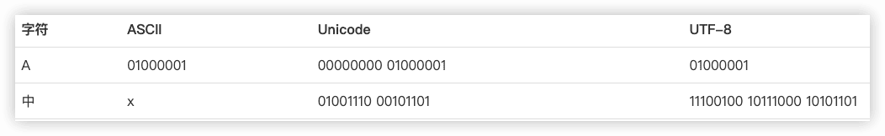
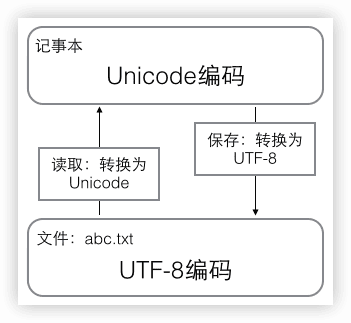
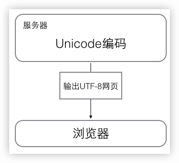
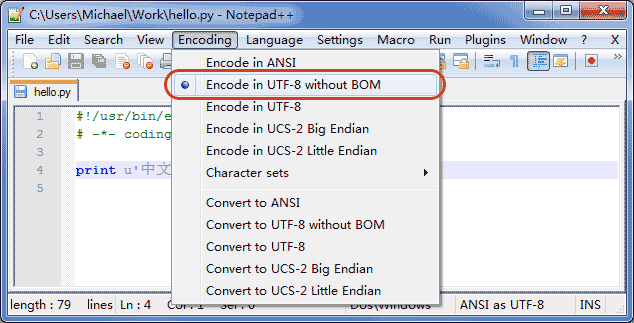

## 廖雪峰Python教程学习笔记


[Python教程 - 廖雪峰的官方网站 (liaoxuefeng.com)](https://www.liaoxuefeng.com/wiki/1016959663602400)

## 0 简介

C语言是可以用来编写操作系统的贴近硬件的语言，所以，C语言适合开发那些追求运行速度、充分发挥硬件性能的程序。而Python是用来编写应用程序的高级编程语言。

当你用一种语言开始作真正的软件开发时，你除了编写代码外，还需要很多基本的已经写好的现成的东西，来帮助你加快开发进度。比如说，要编写一个电子邮件客户端，如果先从最底层开始编写网络协议相关的代码，那估计一年半载也开发不出来。高级编程语言通常都会提供一个比较完善的基础代码库，让你能直接调用，比如，针对电子邮件协议的SMTP库，针对桌面环境的GUI库，在这些已有的代码库的基础上开发，一个电子邮件客户端几天就能开发出来。

Python就为我们提供了非常完善的基础代码库，覆盖了网络、文件、GUI、数据库、文本等大量内容，被形象地称作“内置电池（batteries included）”。用Python开发，许多功能不必从零编写，直接使用现成的即可。

除了内置的库外，Python还有大量的第三方库，也就是别人开发的，供你直接使用的东西。当然，如果你开发的代码通过很好的封装，也可以作为第三方库给别人使用。

许多大型网站就是用Python开发的，例如YouTube、[Instagram](http://instagram.com/)，还有国内的[豆瓣](http://www.douban.com/)。很多大公司，包括Google、Yahoo等，甚至[NASA](http://www.nasa.gov/)（美国航空航天局）都大量地使用Python。

龟叔给Python的定位是“优雅”、“明确”、“简单”，所以Python程序看上去总是简单易懂，初学者学Python，不但入门容易，而且将来深入下去，可以编写那些非常非常复杂的程序。

### Python适合开发哪些类型的应用呢？

首选是网络应用，包括网站、后台服务等等；

其次是许多日常需要的小工具，包括系统管理员需要的脚本任务等等；

另外就是把其他语言开发的程序再包装起来，方便使用。

### 缺点

1. 速度慢

但是大量的应用程序不需要这么快的运行速度，因为用户根本感觉不出来。例如开发一个下载MP3的网络应用程序，C程序的运行时间需要0.001秒，而Python程序的运行时间需要0.1秒，慢了100倍，但由于网络更慢，需要等待1秒，你想，用户能感觉到1.001秒和1.1秒的区别吗？这就好比F1赛车和普通的出租车在北京三环路上行驶的道理一样，虽然F1赛车理论时速高达400公里，但由于三环路堵车的时速只有20公里，因此，作为乘客，你感觉的时速永远是20公里。

2. 是代码不能加密

如果要发布你的Python程序，实际上就是发布源代码，这一点跟C语言不同，C语言不用发布源代码，只需要把编译后的机器码（也就是你在Windows上常见的xxx.exe文件）发布出去。要从机器码反推出C代码是不可能的，所以，凡是编译型的语言，都没有这个问题，而解释型的语言，则必须把源码发布出去。

这个缺点仅限于你要编写的软件需要卖给别人挣钱的时候。好消息是目前的互联网时代，靠卖软件授权的商业模式越来越少了，靠网站和移动应用卖服务的模式越来越多了，后一种模式不需要把源码给别人。

### 安装Python


### Python解释器

+ [CPython](https://github.com/python/cpython)。Python3官方默认的
+ IPython

基于CPython，只是在交互方式上有所增强。

CPython用`>>>`作为提示符，而IPython用`In [序号]:`作为提示符。

+ PyPy

PyPy采用[JIT技术](http://en.wikipedia.org/wiki/Just-in-time_compilation)，对Python代码进行动态编译（注意不是解释），所以可以显著提高Python代码的执行速度。

+ Jython，运行在Java平台上的Python解释器，可以直接把Python代码编译成Java字节码执行。


### 第一个Python程序

#### 文本编辑器

Word保存的不是纯文本文件，而记事本会自作聪明地在文件开始的地方加上几个特殊字符（UTF-8 BOM）

#### 直接运行py文件

```python
#!/usr/bin/env python3

print('hello, world')
```

`$ chmod a+x hello.py`

Python的交互模式和直接运行.py文件的区别  
+ 交互模式： 启动Python解释器，等待输入，一行一行的解释
+ 直接运行： 启动了Python解释器，然后一次性把.py文件的源代码给执行了

#### 输入和输出

+ 输出`print()`

```python
>>> print('The quick brown fox', 'jumps over', 'the lazy dog')
The quick brown fox jumps over the lazy dog

>>> print('100 + 200 =', 100 + 200)
100 + 200 = 300
```

- 输入`input()`

```python
>>> name = input()
andy
```


 

## 1 Python基础

自然语言在不同的语境下有不同的理解，而计算机要根据编程语言执行任务，就必须保证编程语言写出的程序决不能有歧义

`#` 是注释，其他每一行都是一个语句，当语句以冒号“:”结尾时，缩进的语句视为代码块。

Python程序是大小写敏感的

### 数据类型

#### 整数

`1`，`100`，`-8080`，`0`

`0xff00`，`0xa5b4c3d2`

`10_000_000_000`和`10000000000` ，十六进制数也可以写成`0xa1b2_c3d4`

#### 浮点数

`1.23`，`3.14`，`-9.01`

对于很大或很小的浮点数，就必须用科学计数法表示，把10用e替代，1.23x109就是`1.23e9`，或者`12.3e8`，0.000012可以写成`1.2e-5`，等等。

#### 字符串

如果字符串内部既包含`'`又包含`"` 可以用转义字符`\`来标识，比如：

```python
'I\'m \"OK\"!'
```

用`r''`表示''内部的字符串默认不转义

```python
>>> print '\\\t\\'
\       \
>>> print r'\\\t\\'
\\\t\\
```

多行字符串 `'''...'''`

```python
>>> print('''line1
    line2
    line3''')
line1
line2
line3
```

#### 布尔值

`True`  `False`

#### 空值

 `None`

### 变量

变量在程序中就是用一个变量名表示了，变量名必须是大小写英文、数字和`_`的组合，且不能用数字开头

> 变量本身类型不固定的语言称之为*动态语言*，与之对应的是*静态语言*。静态语言在定义变量时必须指定变量类型，如果赋值的时候类型不匹配，就会报错。例如Java是静态语言。

```python
a = 'ABC'
b = a
a = 'XYZ'
print(b)  # ABC 
```


常量

> `/`
>
> `//`  地板除，两个整数的除法仍然是整数


### 字符串和编码

ASCII、Unicode、UTF-8（“可变长编码”）



UTF-8编码有一个额外的好处，就是ASCII编码实际上可以被看成是UTF-8编码的一部分，所以，大量只支持ASCII编码的历史遗留软件可以在UTF-8编码下继续工作。


在计算机内存中，统一使用Unicode编码，当需要保存到硬盘或者需要传输的时候，就转换为UTF-8编码。 
用记事本编辑的时候，从文件读取的UTF-8字符被转换为Unicode字符到内存里，编辑完成后，保存的时候再把Unicode转换为UTF-8保存到文件：  



浏览网页的时候，服务器会把动态生成的Unicode内容转换为UTF-8再传输到浏览器： 


#### Python的字符串

Python3中，字符串是以Unicode编码的，也就是说，Python的字符串支持多语言。`str`

```python
>>> print('包含中文的str')
包含中文的str

>>> ord('A')
65
>>> ord('中')
20013
>>> chr(66)
'B'
>>> chr(25991)
'文'

>>> '\u4e2d\u6587'
'中文'
```

如果要在网络上传输，或者保存到磁盘上，就需要把`str`变为以字节为单位的`bytes`（用带`b`前缀的单引号或双引号表示）：

```python
x = b'ABC'
```

`bytes`的每个字符都只占用一个字节。🔖

以Unicode表示的`str`通过`encode()`方法可以编码为指定的`bytes`，例如：

```python
>>> 'ABC'.encode('ascii')
b'ABC'
>>> '中文'.encode('utf-8')
b'\xe4\xb8\xad\xe6\x96\x87'
>>> '中文'.encode('ascii')
Traceback (most recent call last):
  File "<stdin>", line 1, in <module>
UnicodeEncodeError: 'ascii' codec can't encode characters in position 0-1: ordinal not in range(128)
```

纯英文的`str`可以用`ASCII`编码为`bytes`，内容是一样的，含有中文的`str`可以用`UTF-8`编码为`bytes`。含有中文的`str`无法用`ASCII`编码，因为中文编码的范围超过了`ASCII`编码的范围，Python会报错。

在`bytes`中，无法显示为ASCII字符的字节，用`\x##`显示。

反过来，如果我们从网络或磁盘上读取了字节流，那么读到的数据就是`bytes`。要把`bytes`变为`str`，就需要用`decode()`方法：

```python
>>> b'ABC'.decode('ascii')
'ABC'
>>> b'\xe4\xb8\xad\xe6\x96\x87'.decode('utf-8')
'中文'
```

如果`bytes`中包含无法解码的字节，`decode()`方法会报错：

```python
>>> b'\xe4\xb8\xad\xff'.decode('utf-8')
Traceback (most recent call last):
  ...
UnicodeDecodeError: 'utf-8' codec can't decode byte 0xff in position 3: invalid start byte
```

如果`bytes`中只有一小部分无效的字节，可以传入`errors='ignore'`忽略错误的字节：

```python
>>> b'\xe4\xb8\xad\xff'.decode('utf-8', errors='ignore')
'中'
```


要计算`str`包含多少个**字符**，可以用`len()`函数：

```python
>>> len('ABC')
3
>>> len('中文')
2
```

`len()`函数计算的是`str`的字符数，如果换成`bytes`，`len()`函数就计算字节数：

```python
>>> len(b'ABC')
3
>>> len(b'\xe4\xb8\xad\xe6\x96\x87')
6
>>> len('中文'.encode('utf-8'))
6
```


> 在操作字符串时，我们经常遇到`str`和`bytes`的互相转换。为了避免乱码问题，应当始终坚持使用UTF-8编码对`str`和`bytes`进行转换。


由于Python源代码也是一个文本文件，所以，当你的源代码中包含中文的时候，在保存源代码时，就需要务必指定保存为UTF-8编码。当Python解释器读取源代码时，为了让它按UTF-8编码读取，我们通常在文件开头写上这两行：

```python
#!/usr/bin/env python3
# -*- coding: utf-8 -*-
```

第一行注释是为了告诉Linux/OS X系统，这是一个Python可执行程序，Windows系统会忽略这个注释；

第二行注释是为了告诉Python解释器，按照UTF-8编码读取源代码，否则，你在源代码中写的中文输出可能会有乱码。


申明了UTF-8编码并不意味着你的`.py`文件就是UTF-8编码的，必须并且要确保文本编辑器正在使用UTF-8 without BOM编码：🔖



#### 格式化

##### %

类似于C语言 ： `'Hi, %s, you have $%d.' % ('Michael', 1000000)`

```python
>>> 'Hello, %s' % 'world'
'Hello, world'
>>> 'Hi, %s, you have $%d.' % ('Michael', 1000000)
'Hi, Michael, you have $1000000.'
```

```python
print('%2d-%02d' % (3, 1))
print('%.2f' % 3.1415926)
```

在字符串内部，`%s`表示用字符串替换，`%d`表示用整数替换，`%f`表示浮点数，`%x`表示十六进制整数。

有几个`%?`占位符，后面就跟几个变量或者值，顺序要对应好。如果只有一个`%?`，括号可以省略。

不太确定应该用什么，`%s`永远起作用，它会把任何数据类型转换为字符串。

用`%%`来表示一个作为普通字符的`%`。

##### format()

传入的参数依次替换字符串内的占位符`{0}`、`{1}`……，这种方式写起来比%要麻烦得多：

```python
>>> 'Hello, {0}, 成绩提升了 {1:.1f}%'.format('小明', 17.125)
'Hello, 小明, 成绩提升了 17.1%'
```

##### f-string

使用以`f`开头的字符串，称之为`f-string`

```python
>>> r = 2.5
>>> s = 3.14 * r ** 2
>>> print(f'The area of a circle with radius {r} is {s:.2f}')
The area of a circle with radius 2.5 is 19.62
```


```python
# -*- coding: utf-8 -*-

s1 = 72
s2 = 85

r = (s2-s1)/s1*100
print('小明的成绩提升了%.1f%%' % r)
```


### 使用list和tuple

#### list

list是一种可变的有序的集合，可以随时添加和删除其中的元素。

```python
>>> classmates = ['Michael', 'Bob', 'Tracy']
>>> classmates
['Michael', 'Bob', 'Tracy']
>>> len(classmates)
3
>>> classmates[0]
'Michael'
>>> classmates[1]
'Bob'
>>> classmates[2]
'Tracy'
>>> classmates[3]
Traceback (most recent call last):
  File "<stdin>", line 1, in <module>
IndexError: list index out of range
>>> classmates[-1]
'Tracy'
>>> classmates.append('Adam')
>>> classmates
['Michael', 'Bob', 'Tracy', 'Adam']
>>> classmates.insert(1, 'Jack')
>>> classmates
['Michael', 'Jack', 'Bob', 'Tracy', 'Adam']
>>> classmates.pop()
'Adam'
>>> classmates
['Michael', 'Jack', 'Bob', 'Tracy']
>>> classmates.pop(1)   # 删除指定位置的元素
'Jack'
>>> classmates
['Michael', 'Bob', 'Tracy']
>>> classmates[1] = 'Sarah'
>>> classmates
['Michael', 'Sarah', 'Tracy']
```

list里面的元素的数据类型也可以不同，也可以是另一个list。

```python
>>> L = ['Apple', 123, True]
>>> s = ['python', 'java', ['asp', 'php'], 'scheme']
>>> s[2][1]
'php'
```


#### tuple 

另一种有序列表叫元组：tuple。tuple和list非常类似，但是tuple一旦初始化就不能修改。

```
>>> classmates = ('Michael', 'Bob', 'Tracy')
```

> 不可变的tuple有什么意义？因为tuple不可变，所以代码更安全。如果可能，能用tuple代替list就尽量用tuple。

```python
>>> t = (1,)   # wei避免歧义，一个元素必须加一个逗号
```


```python
>>> t = ('a', 'b', ['A', 'B'])
>>> t[2][0] = 'X'
>>> t[2][1] = 'Y'
>>> t
('a', 'b', ['X', 'Y'])
```


### 条件判断

```python
if <条件判断1>:
    <执行1>
elif <条件判断2>:
    <执行2>
elif <条件判断3>:
    <执行3>
else:
    <执行4>
```


#### 再议 input

```python
s = input('birth: ')
birth = int(s)			# input()返回的数据类型是str，必须转换
if birth < 2000:
    print('00前')
else:
    print('00后')
```


### 模式匹配

```python
score = 'B'
if score == 'A':
    print('score is A.')
elif score == 'B':
    print('score is B.')
elif score == 'C':
    print('score is C.')
else:
    print('invalid score.')
```

如果用`match`语句改写，则改写如下：

```python
# -*- coding: utf-8 -*-
score = 'B'

match score:
    case 'A':
        print('score is A.')
    case 'B':
        print('score is B.')
    case 'C':
        print('score is C.')
    case _: # _表示匹配到其他任何情况
        print('score is ???.')
```


`match`语句除了可以匹配简单的单个值外，还可以匹配多个值、匹配一定范围，并且把匹配后的值绑定到变量：

```python
# -*- coding: utf-8 -*-
age = 15

match age:
    case x if x < 10:			# 表示当age < 10成立时匹配，且赋值给变量x
        print(f'< 10 years old: {x}')
    case 10:
        print('10 years old.')
    case 11 | 12 | 13 | 14 | 15 | 16 | 17 | 18:
        print('11~18 years old.')
    case 19:
        print('19 years old.')
    case _:
        print('not sure.')
```


`match`语句还可以匹配列表:

```python
# -*- coding: utf-8 -*-
args = ['gcc', 'hello.c', 'world.c']
# args = ['clean']
# args = ['gcc']

match args:
    # 如果仅出现gcc，报错:
    case ['gcc']:
        print('gcc: missing source file(s).')
    # 出现gcc，且至少指定了一个文件:
    case ['gcc', file1, *files]:  # 表示列表第一个字符串是'gcc'，第二个字符串绑定到变量file1，后面的任意个字符串绑定到*files（符号*的作用将在函数的参数中讲解），它实际上表示至少指定一个文件；
        print('gcc compile: ' + file1 + ', ' + ', '.join(files))
    # 仅出现clean:
    case ['clean']:
        print('clean')
    case _:
        print('invalid command.')
```


### 循环

- for...in循环

```python
names = ['Michael', 'Bob', 'Tracy']
for name in names:
    print(name)
    
sum = 0
for x in range(101):
    sum = sum + x
print(sum)
```

可以通过`list()`函数转换`range()`函数结果为list。

- while循环


- break

```python
n = 1
while n <= 100:
    if n > 10: # 当n = 11时，条件满足，执行break语句
        break # break语句会结束当前循环
    print(n)
    n = n + 1
print('END')
```


- continue


### 使用dict和set

#### dict

全称dictionary，在其他语言中也称为map，使用键-值（key-value）存储，具有极快的查找速度。

```py
>>> d = {'Michael': 95, 'Bob': 75, 'Tracy': 85}
>>> d['Michael']
95
```

和list比较，dict有以下几个特点：

1. 查找和插入的速度极快，不会随着key的增加而变慢；
2. 需要占用大量的内存，内存浪费多。

而list相反：

1. 查找和插入的时间随着元素的增加而增加；
2. 占用空间小，浪费内存很少。

#### set

set和dict类似，也是一组key的集合，但不存储value。由于key不能重复，所以，在set中，没有重复的key。

```python
>>> s = set([1, 1, 2, 2, 3, 3])
>>> s
{1, 2, 3}
>>> s.add(4)
>>> s.remove(4)

>>> s1 = set([1, 2, 3])
>>> s2 = set([2, 3, 4])
>>> s1 & s2
{2, 3}
>>> s1 | s2
{1, 2, 3, 4}
```

set和dict的唯一区别仅在于没有存储对应的value，但是，set的原理和dict一样，所以，同样不可以放入可变对象，因为无法判断两个可变对象是否相等，也就无法保证set内部“不会有重复元素”。试试把list放入set，看看是否会报错。


#### 再议不可变对象

上面我们讲了，str是不变对象，而list是可变对象。


对于不变对象来说，调用对象自身的任意方法，也不会改变该对象自身的内容。相反，这些方法会创建新的对象并返回，这样，就保证了不可变对象本身永远是不可变的。

## 2 函数

- 函数就是最基本的一种代码抽象的方式。
- 调用函数
    + `abs(2)`
    + `cmp(x,y)`
    + `int()`
    + `float()`
    + `str()`
    + `unicode()`
    + `bool()`
    + 函数名其实就是指向一个函数对象的引用，完全可以把函数名赋给一个变量，相当于给这个函数起了一个“别名”
- 定义函数

        def my_abs(x):
            if x>=0:
                return x
            else: 
                return -x

    + 空函数   `pass`
    + 参数检查
    + 返回多个值
- 函数的参数
    + 默认参数
        * 当函数有多个参数时，把变化大的参数放前面，变化小的参数放后面。变化小的参数就可以作为默认参数。
        * 当不按顺序提供部分默认参数时，需要把参数名写上
        * 默认参数必须指向不变对象
    + 可变参数(tuple)
        ``` python
            def calc(*numbers):
                sum = 0
                for n in numbers:
                    sum = sum + n * n
                return sum
        ```
        `*numbers` 表示接受到的是一个tuple
    + 关键字参数(dict)

            def person(name, age, **other):
            print 'name:', name, 'age:', age, 'other:', other
            
            person('andy', 25, location="shanghai", weight="70")
            
            kw = {'city': 'Beijing', 'job': 'Engineer'}
            person('Jack', 24, **kw)

    + 参数组合
        * 顺序必须是：必选参数、默认参数、可变参数和关键字参数。

        ````python
            def func(a, b, c=0, *args, **kw):
                print 'a:', a, 'b:', b, 'c:', c, 'args:', args, 'kw:', kw 
        
            func(1, 3, 4, 5, 6, 23)
            func(1, 3, 4, 5, 6, ab=23)
            args = (12, 5, 6, 7)
            kw = {"key1": 90, 'x': 999}
            func(*args, **kw)
        ````
        * 对于任意函数，都可以通过类似func(*args, **kw)的形式调用它，无论它的参数是如何定义的。
- 递归函数
    + 使用递归函数需要注意防止栈溢出。在计算机中，函数调用是通过栈（stack）这种数据结构实现的，每当进入一个函数调用，栈就会加一层栈帧，每当函数返回，栈就会减一层栈帧。由于栈的大小不是无限的，所以，递归调用的次数过多，会导致栈溢出。
    + **尾递归**
    + [尾调用](https://zh.wikipedia.org/wiki/%E5%B0%BE%E8%B0%83%E7%94%A8)
    + 在尾调用的情况中，电脑不需要记住尾调用的位置而可以从被调用的函数直接带着返回值返回调用函数的返回位置（相当于直接连续返回两次），尾调用消除即是在不改变当前调用栈（也不添加新的返回位置）的情况下跳到新函数的一种优化（完全不改变调用栈是不可能的，还是需要校正调用栈上形参与局部变量的信息。）

## 3 高级特性

- 切片 (list, tuple, 字符串)
    + `L[:10:2]`    前10个数，每两个取一个
    + `L[::5]`      所有数，每5个取一个
- 迭代 `for in` 
    + 任何 **可迭代对象** 都可以，如：list, tuple, dict, 字符串
    + 判断是否可迭代（通过collections模块的Iterable类型判断）：

            from collections import Iterable
            isinstance('abc', Iterable) # str是否可迭代
            isinstance(123, Iterable) # 整数是否可迭代 

    + dict的存储不是按照list的方式顺序排列，所以，迭代出的结果顺序很可能不一样。

- 列表生成式
    + 运用列表生成式，可以快速生成list，可以通过一个list推导出另一个list，而代码却十分简洁。
    + `[x*x for x in range(1, 11)]`   =>  `[1x1, 2x2, 3x3, ..., 10x10]` (`[1, 4, 9, 16, 25, 36, 49, 64, 81, 100]`)
    + `[x * x for x in range(1, 11) if x % 2 == 0]`  =>  `[4, 16, 36, 64, 100]`
    + `m + n for m in 'ABC' for n in 'XYZ']`  =>   `['AX', 'AY', 'AZ', 'BX', 'BY', 'BZ', 'CX', 'CY', 'CZ']`
    + `[d for d in os.listdir('.')]` 列出当前目录下文件和目录
    ```
    L1 = ['Hello', 'World', 18, 'Apple', None]
    [s.lower() for s in L2 if isinstance(s, str)]
    ```
- 生成器Generator(保存的是算法)
    + 一边循环一边计算的机制
    + 创建generator的方法
        * 把一个列表生成式的[]改成()
        ```
        >>> L = [x * x for x in range(10)]
        >>> L
        [0, 1, 4, 9, 16, 25, 36, 49, 64, 81]
        >>> g = (x * x for x in range(10))
        >>> g
        <generator object <genexpr> at 0x1022ef630>
        ```
    + generator保存的是算法，每次调用next(g)，就计算出g的下一个元素的值，直到计算到最后一个元素，没有更多的元素时，抛出`StopIteration`的错误。(也可直接用for in，就没有`StopIteration`的错误)    
    + 例子
    ```python
    g = (x*x for x in range(10))
    for n in g:
        print n 
    ````
    + 如果一个函数定义中包含yield关键字，那么这个函数就不再是一个普通函数，而是一个generator
    + 函数是顺序执行，遇到return语句或者最后一行函数语句就返回。而变成generator的函数，在每次调用next()的时候执行，遇到yield语句返回，再次执行时从上次返回的yield语句处继续执行


## 4 函数式编程

- 高阶函数
    + 既然变量可以指向函数，函数的参数能接收变量，那么一个函数就可以接收另一个函数作为参数，这种函数就称之为高阶函数。
    + 编写高阶函数，就是让函数的参数能够接收别的函数。
    + map/reduce  （MapReduce: Simplified Data Processing on Large Clusters)[]
        * map()函数接收两个参数，一个是函数，一个是序列，map将传入的函数依次作用到序列的每个元素，并把结果作为新的list返回。
        * reduce把一个函数作用在一个序列[x1, x2, x3...]上，这个函数必须接收两个参数，reduce把结果继续和序列的下一个元素做累积计算，其效果就是：    
        `reduce(f, [x1, x2, x3, x4]) = f(f(f(x1, x2), x3), x4)`
    + filter  filter()函数接收两个参数，一个是函数，一个是序列,把传入的函数依次作用于每个元素，然后根据返回值是True还是False决定保留还是丢弃该元素。
    + sorted
        * 排序也是在程序中经常用到的算法。无论使用冒泡排序还是快速排序，排序的核心是比较两个元素的大小。如果是数字，我们可以直接比较，但如果是字符串或者两个dict呢？直接比较数学上的大小是没有意义的，因此，比较的过程必须通过函数抽象出来。通常规定，对于两个元素x和y，如果认为x < y，则返回-1，如果认为x == y，则返回0，如果认为x > y，则返回1，这样，排序算法就不用关心具体的比较过程，而是根据比较结果直接排序。
- 返回函数
- 匿名函数(lambda)
    + 只能有一个表达式，不用写return，返回值就是该表达式的结果
- 装饰器
    + 在代码运行期间动态增加功能的方式，称之为“装饰器”（Decorator）。
    + `__name__`
- 偏函数（Partial function）
    + `functools.partial`的作用就是，把一个函数的某些参数给固定住（也就是设置默认值），返回一个新的函数，调用这个新函数会更简单。

## 5 模块

- 一个.py文件就称之为一个模块（Module）
    + [内置函数](https://docs.python.org/2/library/functions.html)
    + 为了避免模块名冲突，Python又引入了按目录来组织模块的方法，称为**包（Package）**
    + 每一个包目录下面都必须有一个`__init__.py`的文件
- **别名**

        try:
            import cStringIO as StringIO
        except ImportError: # 导入失败会捕获到ImportError
            import StringIO
        
        try:
            import json # python >= 2.6
        except ImportError:
            import simplejson as json # python <= 2.5

- 作用域
- 安装第三方模块
    + 在Python中，安装第三方模块，是通过setuptools这个工具完成的。Python有两个封装了setuptools的包管理工具：easy_install和pip。
        * mac中自带 `easy_install`, 
        * mac 安装 `pip`: `sudo easy_install pip`
        * 第三方库都会在Python官方 [网站](https://pypi.python.org/pypi) 上注册
        * 安装 `pillow`(代替`PIL`)：`sudo pip install pillow`
        * 使用 [github](https://github.com/python-pillow/Pillow) [中文文档](http://pillow-cn.readthedocs.io/zh_CN/latest/index.html)

                from PIL import Image
                im = Image.open("/Users/andyron/Downloads/bash.jpg")  #录取要是完整路径
                im.size
                im.mode
                im.format 
                im.show()       # 以临时文件打开

        * 其他系统 `sudo apt-get install python-pip` `sudo apt-get install python-pip`    
    + 模块搜索路径

            import sys
            sys.path
            sys.path.append()

- 使用__future__
  
    + Python提供了__future__模块，把下一个新版本的特性导入到当前版本，于是我们就可以在当前版本中测试一些新版本的特性。

## 6 面向对象编程

- 对比
    + 面向过程的程序设计把计算机程序视为一系列的命令集合，即一组函数的顺序执行。为了简化程序设计，面向过程把函数继续切分为子函数，即把大块函数通过切割成小块函数来降低系统的复杂度。

    + 面向对象的程序设计把计算机程序视为一组对象的集合，而每个对象都可以接收其他对象发过来的消息，并处理这些消息，计算机程序的执行就是一系列消息在各个对象之间传递。

- 类和实例
    + `__init__`方法的第一个参数永远是self，表示创建的实例本身
    + 和普通的函数相比，在类中定义的函数只有一点不同，就是第一个参数永远是实例变量self，并且，调用时，不用传递该参数。
    + Python允许对实例变量绑定任何数据
- 访问限制
    + 实例的变量名如果以`__`开头，就变成了一个私有变量（private），只有内部可以访问，外部不能访问
    + Python本身没有任何机制阻止你干坏事，一切全靠自觉。

- 继承和多态

- 获取对象信息
    + `type()` `types`
    + `isinstance()`
    + `dir()` 获得一个对象的所有属性和方法
        * 类似__xxx__的属性和方法在Python中都是有特殊用途的.如，`str`类型中有 `__len__`方法，就可以 `len('ABC')` 或 'ABC'.__len__(), 并且这里的 'ABC'必须是`str`
        * `getattr()` `setattr()` `hasattr()`

## 7 面向对象高级编程

- 使用__slots__
    + 动态绑定
    + 定义class的时候，定义一个特殊的__slots__变量，来限制该class能添加的属性(仅对当前类起作用，对继承的子类是不起作用的)
- 使用@property(限制属性)
    + 装饰器
    + getter setter
- 多重继承
    + Mixin的目的就是给一个类增加多个功能，这样，在设计类的时候，我们优先考虑通过多重继承来组合多个Mixin的功能，而不是设计多层次的复杂的继承关系。
- 定制类
    + `__str__` : `print`时调用
    + `__repr__` : 直接显示时调用
    + `__iter__` : 如果一个类想被用于for ... in循环，类似list或tuple那样，就必须实现一个__iter__()方法，该方法返回一个迭代对象，然后，Python的for循环就会不断调用该迭代对象的next()方法拿到循环的下一个值，直到遇到StopIteration错误时退出循环。
    + `__getitem__` : 直接作为list时调用
    + `__getattr__` : 当调用不存在的属性或方法是调用
    + `__call__`: 在对象作为函数被调用时会调用该方法
    + [更多定制](https://docs.python.org/2/reference/datamodel.html#special-method-names)
- 使用元类
    + `type()`
    + metaclass

## 8 错误、调试和测试

- 错误 
    + `try...except...finally...`   可以跨越多层
    + [`BaseException`](https://docs.python.org/2/library/exceptions.html#exception-hierarchy)
    + 调用堆栈
    + 记录错误  `logging`模块
    + 抛出错误  `raise`
        * 只有在必要的时候才定义我们自己的错误类型。如果可以选择Python已有的内置的错误类型（比如ValueError，TypeError），尽量使用Python内置的错误类型。
        * raise语句如果不带参数，就会把当前错误原样抛出。
- 调式 
    + 直接用`print`
    + 断言 `assert`      可以关闭断言 `python -O err.py`
    + `logging`
        * `debug` `info` `warning` `error` 级别由低到高，级别设置的越高低级别的信息就不会显示（如`logging.basicConfig(level=logging.INFO)`, 就不会显示debug信息）
        * 一条语句可以同时输出到不同的地方，比如console和文件。
    + pdb  调试器，让程序以单步方式运行
        * `python -m pdb err.py`
        * `l` 来查看代码
        * `n` 下一步
        * `p 变量名` 查看变量值
        * `q` 退出
    + pdb.set_trace() 
        * 只需要import pdb，然后，在可能出错的地方放一个pdb.set_trace()，就可以设置一个断点，运行到此处暂停并进入pdb调式环境
    + IDE   PyCharm
- 单元测试
    + “测试驱动开发”（TDD：Test-Driven Development）
    + 单元测试是用来对一个模块、一个函数或者一个类来进行正确性检验的测试工作。


- 文档测试


## 9 IO编程

>同步IO  CPU等着
>异步IO  CPU不等待      回调模式    轮询模式

- 文件读写
    + open()
    + read()
    + readline()
    + readlines()
    + **file-like Object**: 像open()函数返回的这种有个read()方法的对象,也可以是内存的字节流，网络流，自定义流等等。
    + `StringIO`
    + 二进制文件 `f = open('test.jpg', 'rb')`
    + 字符编码 `codecs`模块
    + 写文件  write().当写文件时，操作系统往往不会立刻把数据写入磁盘，而是放到内存缓存起来，空闲的时候再慢慢写入。只有调用close()方法时，操作系统才保证把没有写入的数据全部写入磁盘
    + with  as 
- 操作文件和目录
    + `os`模块   
        * `os.name`  # posix : linux, Unix, Mac OS; nt: window
        * `os.uname()` 系统详细信息(非window)
    + 环境变量 
        * `os.environ`  所有环境变量的dict
        * `os.getenv("PATH")`  获取某个环境变量
    + 操作文件和目录
        * ` os.path.abspath('.')`  查看当前目录的绝对路径
        * `os.path.join('/Users/michael', 'testdir')` 生成当前系统下的需要的目录完整字符串
        * `os.mkdir('/Users/michael/testdir')`
        * `os.rmdir('/Users/michael/testdir')`
        * `os.path.split('/Users/michael/testdir/file.txt')` 
          
            # ('/Users/michael/testdir', 'file.txt')
        * `os.path.splitext('/path/to/file.txt')`
          
            # ('/path/to/file', '.txt')
        * `os.rename('test.txt', 'test.py')`    对文件重命名
        * `os.remove('test.py')` 
        * `shutil.copyfile(src, dst)`   复制文件 
        * `os.listdir('.')`     当前目录下文件和目录名的dict
        * `os.path.isdir(x)`   
        * `os.path.isfile(x)`
        * `os.path.realpath(x)` 
- 序列化
    + 把变量从内存中变成可存储或传输的过程。 pickling, serialization, marshalling, flattening
    + `cPickle` `pickle`  

            try:
                import cPickle as pickle
            except ImportError:
                import pickle

        * pickle.dumps()方法把任意对象序列化成一个str
        * pickle.dump()直接把对象序列化后写入一个file-like Object：

            d = dict(name='Bob', age=20, score=88)
            f = open("dump.txt", 'wb')
            pickle.dump(d, f)
            f.close()

        * 用pickle.load()方法从一个file-like Object中直接反序列化出对象

            f = open("dump.txt", 'rb')
            d = pickle.load(f)
            f.close()

            print d
        * 只能用于Python，不同版本的Python彼此都不兼容
    + JSON 

## 10 进程和线程

- 概述
    + 表面上看，每个任务都是交替执行的，但是，由于CPU的执行速度实在是太快了，我们感觉就像所有任务都在同时执行一样。
    + 对于操作系统来说，一个任务就是一个进程（Process）
    + 进程内的这些“子任务”称为线程（Thread）
    + 多任务的实现有3种方式
        * 多进程模式
        * 多线程模式
        * 多进程+多线程模式
    + 线程是最小的执行单元，而进程由至少一个线程组成。如何调度进程和线程，完全由操作系统决定，程序自己不能决定什么时候执行，执行多长时间。
    + 多进程和多线程的程序涉及到同步、数据共享的问题，编写起来更复杂。
- 多进程
？？ ImportError: No module named multiprocession


## 11 正则表达式

- 基础
    * `\d`
    * `\w`
    * `\s`
    * . 任意一个字符  * 任意个数字符   + 至少一个字符  ? 0或1个字符  
    * {n} {n,m}
    * []
    * A|B 
    * ^ $
    
      

## 12 常用内建模块

- collections
    + namedtuple    `namedtuple('名称', [属性list])`
    + deque     对list高效实现插入和删除操作的双向列表，适合用于队列和栈
    + defaultdict   给dict中没有的key一个默认值
    + OrderedDict   保持dict中key的顺序 ???
    + Counter
- base64
    + Base64是一种用64个字符来表示任意二进制数据的方法

- [struct](https://docs.python.org/2/library/struct.html#format-characters) ???


- hashlib
    + 摘要算法又称哈希算法、散列算法（如MD5，SHA1等等）： 它通过一个函数，把任意长度的数据转换为一个长度固定的数据串（通常用16进制的字符串表示）。 **单向函数**
    + 碰撞： 任何摘要算法都是把无限多的数据集合映射到一个有限的集合中
    + 摘要算法在很多地方都有广泛的应用。要注意摘要算法不是加密算法，不能用于加密（因为无法通过摘要反推明文），只能用于防篡改，但是它的单向计算特性决定了可以在不存储明文口令的情况下验证用户口令

- itertools
    + `count()`
    + `cycle()`
    + `repeat()`
    + `takewhile()`
    + `chain()`
    + `groupby()`
    + `imap()`
    + `ifilter()`

- XML

- HTMLParser
    + 搜索引擎，第一步是用爬虫把目标网站的页面抓下来，第二步就是解析该HTML页面，看看里面的内容到底是新闻、图片还是视频。
    + HTML本质上是XML的子集，但是HTML的语法没有XML那么严格，所以不能用标准的DOM或SAX来解析HTML。


## 13 常用第三方模块

- 基本上，所有的第三方模块都会在[PyPI - the Python Package Index](https://pypi.python.org/pypi)上注册，只要找到对应的模块名字，即可用easy_install或者pip安装

- PIL   ？？

## 14 图形界面

- Tk（Tkinter）: 内置的， 调用操作系统提供的本地GUI接口

- wxWidgets
- Qt
- GTK

## 15 网络编程

- 网络通信是两台计算机上的两个进程之间的通信
- TCP/IP简介
    + P协议负责把数据从一台计算机通过网络发送到另一台计算机。数据被分割成一小块一小块，然后通过IP包发送出去。由于互联网链路复杂，两台计算机之间经常有多条线路，因此，路由器就负责决定如何把一个IP包转发出去。IP包的特点是按块发送，途径多个路由，但不保证能到达，也不保证顺序到达。
    + TCP协议则是建立在IP协议之上的。TCP协议负责在两台计算机之间建立可靠连接，保证数据包按顺序到达。TCP协议会通过握手建立连接，然后，对每个IP包编号，确保对方按顺序收到，如果包丢掉了，就自动重发。
- TCP 
    + 客户端 
        * 80端口是Web服务的标准端口，SMTP服务是25端口，FTP服务是21端口，等等。端口号小于1024的是Internet标准服务的端口，端口号大于1024的，可以任意使用。
        * TCP连接创建的是双向通道，双方都可以同时给对方发数据。但是谁先发谁后发，怎么协调，要根据具体的协议来决定。
    + 服务端
    
- UDP编程

## 16 电子邮件

- 概念  
MUA：Mail User Agent——邮件用户代理（Outlook或者Foxmail之类的软件）  
MTA：Mail Transfer Agent——邮件传输代理（Email服务提供商，比如网易、新浪等等） 
MDA：Mail Delivery Agent——邮件投递代理  
发件人 -> MUA -> MTA -> MTA -> 若干个MTA -> MDA <- MUA <- 收件人   
发邮件时，MUA和MTA使用的协议就是SMTP：Simple Mail Transfer Protocol，后面的MTA到另一个MTA也是用SMTP协议。  
收邮件时，MUA和MDA使用的协议有两种：POP：Post Office Protocol，目前版本是3，俗称POP3；IMAP：Internet Message Access Protocol，目前版本是4，优点是不但能取邮件，还可以直接操作MDA上存储的邮件，比如从收件箱移到垃圾箱，等等。

## 17 访问数据库

- 使用SQLite
    + Python内置了SQLite3
- 使用MySQL
    + 由于Python的DB-API定义都是通用的，所以，操作MySQL的数据库代码和SQLite类似。
    + 通常我们在连接MySQL时传入use_unicode=True，让MySQL的DB-API始终返回Unicode
- 使用SQLAlchemy(ORM框架)
    + 由于关系数据库的多个表还可以用外键实现一对多、多对多等关联，相应地，ORM框架也可以提供两个对象之间的一对多、多对多等功能。


### Web开发

- HTTP协议简介
    + 浏览器就是依靠Content-Type来判断响应的内容是网页还是图片，是视频还是音乐。浏览器并不靠URL来判断响应的内容
- WSGI接口
    + 需要一个统一的接口，让我们专心用Python编写Web业务。WSGI：Web Server Gateway Interface。
    + wsgiref   Python内置了的WSGI服务器
- 使用Web框架
    + 有了Web框架，我们在编写Web应用时，注意力就从WSGI处理函数转移到URL+对应的处理函数，这样，编写Web App就更加简单了。
    + 在编写URL处理函数时，除了配置URL外，从HTTP请求拿到用户数据也是非常重要的。Web框架都提供了自己的API来实现这些功能。Flask通过request.form['name']来获取表单的内容。
- 使用模板

### 异步IO

- CPU高速执行能力和IO设备的龟速严重不匹配
- 异步IO模型    消息循环
- 消息模型其实早在应用在桌面应用程序中了。一个GUI程序的主线程就负责不停地读取消息并处理消息。所有的键盘、鼠标等消息都被发送到GUI程序的消息队列中，然后由GUI程序的主线程处理。由于GUI线程处理键盘、鼠标等消息的速度非常快，所以用户感觉不到延迟

- 协程（微线程，纤程，Coroutine）


### [virtualenv](https://www.liaoxuefeng.com/wiki/0014316089557264a6b348958f449949df42a6d3a2e542c000/001432712108300322c61f256c74803b43bfd65c6f8d0d0000#0)


- `$ pip3 install virtualenv` 
- `$ virtualenv --no-site-packages venv`   创建一个独立的Python运行环境(就是在当前的目录下创建一个`venv`目录，并把Python环境拷贝一份)，`--no-site-packages`这个参数让已经安装到系统Python环境中的所有第三方包都不会复制过来


- `$ source venv/bin/activate`     进入该环境
  
    `(venv) AndydeMacBook-Pro:myPythonProject andyron$`


- `deactivate` 退出环境


-------------
### linux等系统安装 pip

- `wget https://bootstrap.pypa.io/get-pip.py`  下载 文件
- `sudo python get-pip.py`

### 安装

- `sudo pip install requests`

### 记录

- Python格式化中如何使用%
- Python 获得命令行参数  
    脚本名：    sys.argv[0]
    参数1：     sys.argv[1]
    参数2：     sys.argv[2]
- # 字符串匹配
$ python -m timeit "'hello'.index('llo')"
1000000 loops, best of 3: 0.214 usec per loop
- 命令直接运行 `python -c  "print 'hello'.index('llo')"`
- 运行系统shell命令 `python -c "import os; os.system('ls')"` 或 `os.system('ls')`
- 字符串前缀 u和r的区别
在python2里面，u表示unicode string，类型是unicode, 没有u表示byte string，类型是 str。
在python3里面，所有字符串都是unicode string, u前缀没有特殊含义了。

r都表示raw string. 与特殊字符的escape规则有关，一般用在正则表达式里面。
r和u可以搭配使用，例如ur"abc"。


